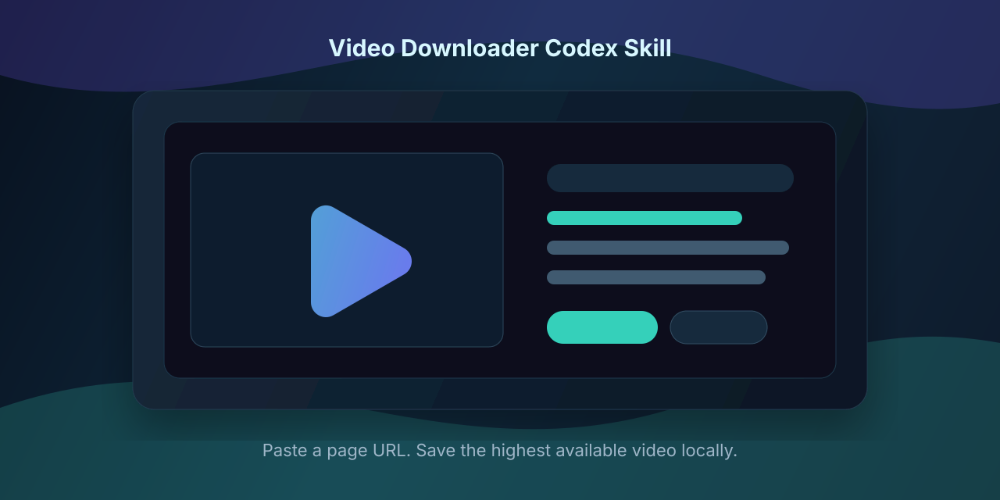

<p align="center">
  
</p>

<h1 align="center">Video Downloader Codex Skill</h1>

<p align="center">
  A small Codex skill that turns a pasted video page URL into a local high-quality download through <code>yt-dlp</code>.
</p>

<p align="center">
  <a href="LICENSE"></a>
  
  
  
  
</p>

## What it does

Video Downloader is a local Codex skill for downloading videos from supported web pages. It wraps `yt-dlp`, chooses the highest available format by default, saves the file locally, and handles Douyin selected-page links that expose the video id through `modal_id`.

Typical prompt:

```text
Use video-downloader to download this video in the highest quality and save it to Desktop:
https://www.douyin.com/jingxuan?modal_id=7619750213330177321
```

## Features

- Highest available video quality by default.
- Desktop-friendly default output folder: `~/Desktop/video-downloads`.
- Douyin `jingxuan?modal_id=...` URL normalization.
- Works with a custom `yt-dlp` wrapper through `YTDLP_WRAPPER`.
- Falls back to `yt-dlp` on `PATH` or `python3 -m yt_dlp` when available.
- Clear failure behavior for unsupported URLs, login walls, CAPTCHA, DRM, or paid access.

## Install

Clone this repository into your Codex skills folder:

```bash
mkdir -p ~/.codex/skills
git clone https://github.com/dudachun/video-downloader.git ~/.codex/skills/video-downloader
chmod +x ~/.codex/skills/video-downloader/scripts/download-video.sh
```

If you already have a local `yt-dlp` wrapper, point the skill at it:

```bash
export YTDLP_WRAPPER="/path/to/run-yt-dlp.sh"
```

Otherwise install `yt-dlp` normally:

```bash
python3 -m pip install -U yt-dlp
```

## Usage

Download to the default folder:

```bash
~/.codex/skills/video-downloader/scripts/download-video.sh "VIDEO_URL"
```

Download to Desktop:

```bash
~/.codex/skills/video-downloader/scripts/download-video.sh "VIDEO_URL" "$HOME/Desktop"
```

Use it from Codex:

```text
Download this webpage video in HD and put it on my Desktop: VIDEO_URL
```

Codex should then use the skill, run the bundled script, and report the saved path plus basic metadata such as resolution, duration, codec, and file size.

## Project Structure

```text
.
├── SKILL.md
├── README.md
├── LICENSE
├── agents/
│   └── openai.yaml
├── assets/
│   └── hero.svg
└── scripts/
    └── download-video.sh
```

## Recommended GitHub Topics

`codex-skill`, `yt-dlp`, `video-downloader`, `douyin`, `tiktok`, `bilibili`, `youtube-dl`, `automation`, `macos`, `bash`

## Limitations

This skill depends on what `yt-dlp` can access. Some sites require login cookies, block automated traffic, use CAPTCHA, put media behind paid access, or protect streams with DRM. This project does not bypass DRM or access controls.

## Safety and Rights

Only download content that you own, have permission to archive, or are otherwise allowed to save under the source site's terms and applicable law.

## License

MIT. See [LICENSE](LICENSE).
